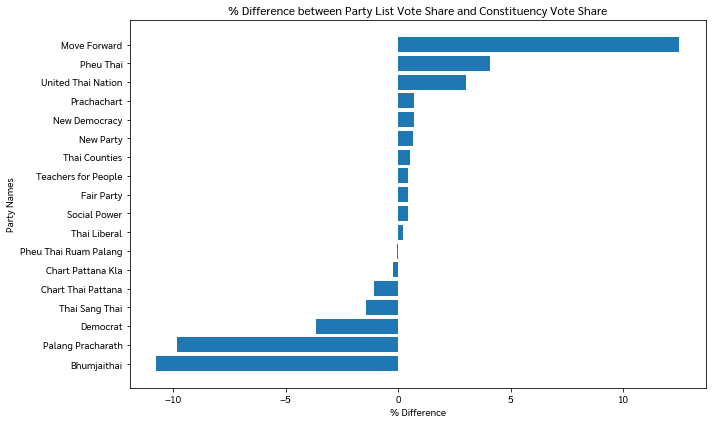
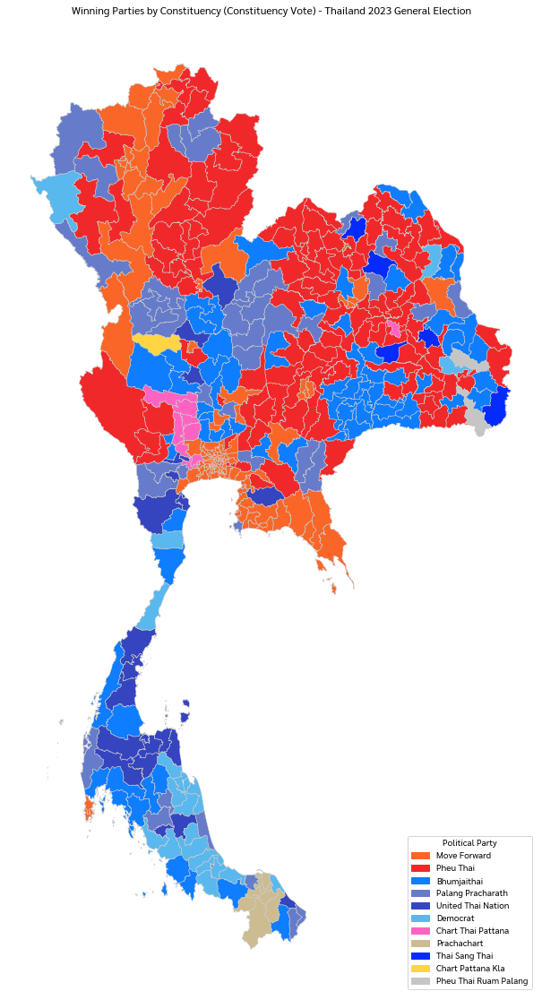
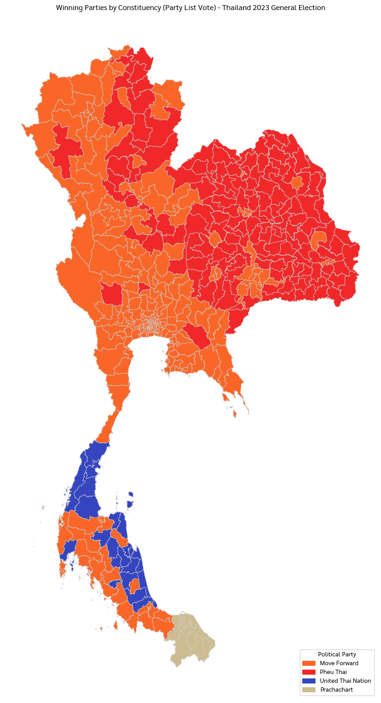
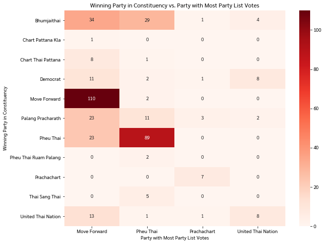
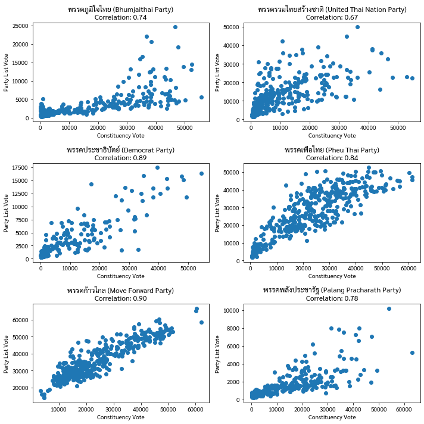
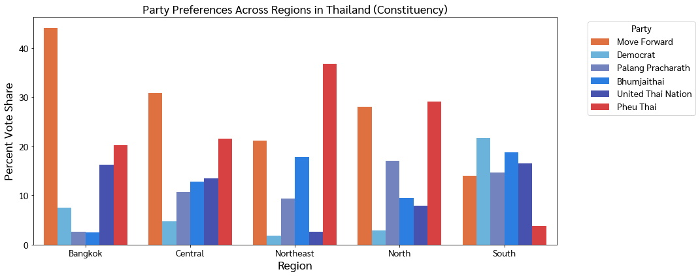
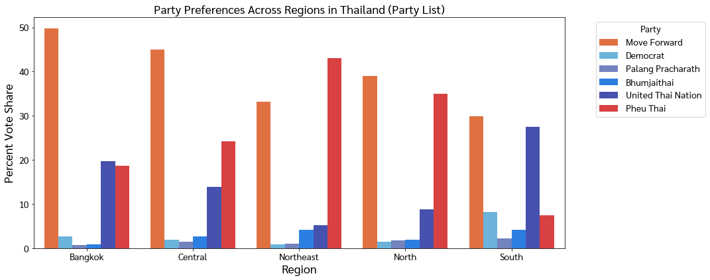
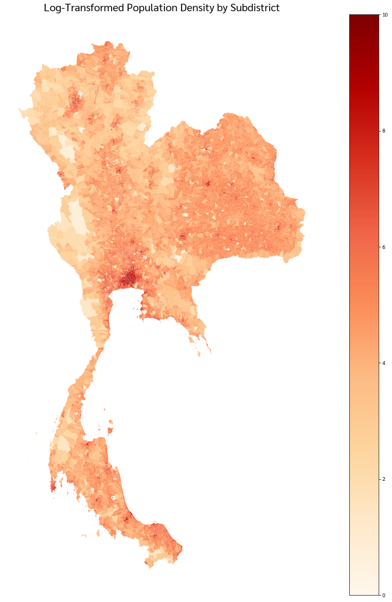
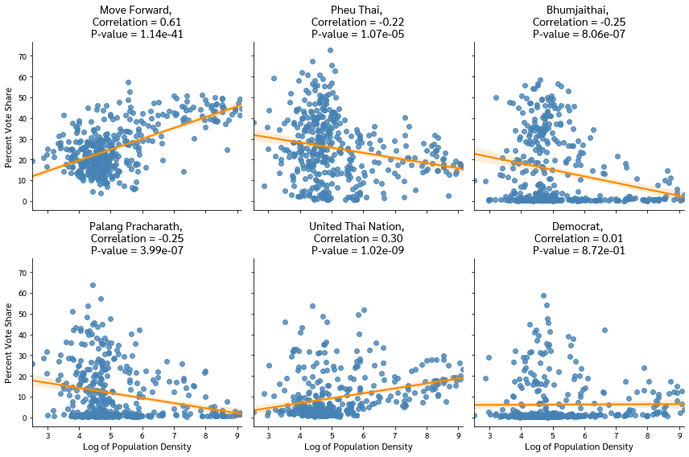

## Repository Structure

- `Thailand_2023_Election.ipynb`: The Jupyter notebook containing the analysis code.
- `shapefiles/`: Directory containing shapefiles used in the analysis
- `figures/`: Directory containing visualizations and outputs generated by the notebook.
- `README.md`: This file, providing an overview of the project and instructions for use.

## Datasets and Shapefiles

The datasets and shapefiles used in this analysis include:  
- [2023 Thai General Election Map](https://github.com/KittapatR/Thai-ECT-election-map-66/blob/main/ECT_constituencies/2566_TH_ECT_attributes.shp) by กฤตพัฒน์ รัตนภูผา สถาบันส่งเสริมการวิเคราะห์และบริหารข้อมูลขนาดใหญ่ภาครัฐ (Government Big Data Institute)
- [Results](https://ectreport66.ect.go.th/data/excel/2566_election_result.xlsx) and [official statistics](https://www.ect.go.th/web-upload/1xff0d34e409a13ef56eea54c52a291126/m_document/2028/21360/file_download/14c269b6893553a8f697f16f32be2e59.xlsx) of the 2023 Thai General Elections by the Election Commission of Thailand
- [2023 Population data](https://stat.bora.dopa.go.th/new_stat/file/65/stat_t65.xls.) by the Bureau of Registration Administration
- [Thailand Subdistrict Boundaries 2023](https://www.arcgis.com/home/item.html?id=d5af177c9cea4ea2be1fa62bc0836f7b) by ESRI Thailand
- [Province and region (ชุดข้อมูลจังหวัดและภูมิภาคในประเทศไทย)](https://data.go.th/dataset/3aa027e3-5485-4da2-89b0-b399fab019a0/resource/0c2aa4d6-90ef-405f-acf2-20507ced4fab/download/25640531_sc002_.xlsx) by Digital Government Development Agency (สำนักงานพัฒนารัฐบาลดิจิทัล)

## Acknowledgements

This project contains codes and analyses for the following articles:
- ["One Constituency, Two Parties: Ballot Splitting and Divided Loyalties in Thailand’s Election"](https://fulcrum.sg/one-constituency-two-parties-ballot-splitting-and-divided-loyalties-in-thailands-election/) by Ken Mathis Lohatepanont and Napon Jatusripitak
- ["A New Tale of Two Democracies? The Changing Urban-Rural Dynamics at Thailand’s 2023 General Elections"](https://bookshop.iseas.edu.sg/component/get/22733) by Allen Hicken, Napon Jatusripitak, and Ken Mathis Lohatepanont

Special thanks to the authors and collaborators who have contributed to the underlying research and analysis.

## License

[MIT License](LICENSE.md)
---

For any further questions or requests, please open an issue in this repository or contact naponjatusripitak@gmail.com

## Codes from Thailand_2023_Election.ipynb

```python
#### Import libraries ####
import pandas as pd
import geopandas as gpd
import matplotlib.pyplot as plt
import matplotlib.font_manager as fm
from os import path
import matplotlib
import seaborn as sns
import numpy as np
import ssl
ssl._create_default_https_context = ssl._create_unverified_context
```


```python
#### Font management ####
if not path.exists('Sarabun-Regular.ttf'):
    !wget https://github.com/google/fonts/raw/main/ofl/sarabun/Sarabun-Regular.ttf -O Sarabun-Regular.ttf
if 'Sarabun' not in [x.name for x in matplotlib.font_manager.fontManager.ttflist]:
    matplotlib.font_manager.fontManager.addfont('Sarabun-Regular.ttf')
matplotlib.rc('font', family='Sarabun')
```


```python
#### Import Data ####

# Import shapefile from https://github.com/KittapatR/Thai-ECT-election-map-66/tree/main/ECT_constituencies/
map_df = gpd.read_file("shapefiles/2566_TH_ECT_attributes.shp")
map_df.rename(columns={'P_name':'จังหวัด', 'CONS_no':'เขต'}, inplace=True)

# Import election results
results_party_list = pd.read_excel('https://ectreport66.ect.go.th/data/excel/2566_election_result.xlsx', sheet_name='ผลคะแนนบัญชีรายชื่อ', skiprows = 3, converters={'เขต':int,'หมายเลข':int})
results_candidate = pd.read_excel('https://ectreport66.ect.go.th/data/excel/2566_election_result.xlsx', sheet_name='ผลคะแนนแบ่งเขต', skiprows = 3, converters={'เขต':int,'หมายเลขผู้สมัคร':int})
constituency_winners = pd.read_excel('https://www.ect.go.th/web-upload/1xff0d34e409a13ef56eea54c52a291126/m_document/2028/21360/file_download/14c269b6893553a8f697f16f32be2e59.xlsx', sheet_name = 'Reรายชื่อผู้ได้รับ แบ่งเขต', skiprows = 3)
party_list_winners = pd.read_excel('https://www.ect.go.th/web-upload/1xff0d34e409a13ef56eea54c52a291126/m_document/2028/21360/file_download/14c269b6893553a8f697f16f32be2e59.xlsx', sheet_name = 'Reผู้ได้รับเลือก บัญชี พรรค', skiprows = 10, converters={'รวม':int})[['Unnamed: 1', 'รวม']]

# Drop the last row (column sum)
results_party_list.drop(results_party_list.tail(1).index,inplace=True)
results_candidate.drop(results_candidate.tail(1).index,inplace=True)

# Cleaning
constituency_winners['จังหวัด'].ffill(inplace=True)
party_list_winners.drop(party_list_winners.tail(15).index,inplace=True)
party_list_winners.rename(columns = {'Unnamed: 1' : 'พรรค', 'รวม': 'total_party_list_seats'}, inplace = True)
```


```python
#### Create a table reporting the election results by party ####

# Sum up the votes for each party from the party list results and reset the index for further manipulation.
party_list_votes = results_party_list.groupby('พรรค')['ผลคะแนน'].sum().reset_index()

# Sum up the votes for each party from the candidate results and reset the index for further manipulation.
constituency_votes = results_candidate.groupby('สังกัดพรรค')['คะแนน'].sum().reset_index()

# Rename columns in 'constituency_votes' for consistency and easier merging.
constituency_votes.rename(columns = {'สังกัดพรรค' : 'พรรค'}, inplace = True)

# Merge the two datasets on the 'พรรค' column to combine the results from party list and constituency votes.
merged_data = constituency_votes.merge(party_list_votes, on='พรรค')

# Rename columns for clarity.
merged_data.rename(columns = {'คะแนน' : 'mp_app_vote', 'ผลคะแนน': 'party_list_vote'}, inplace = True)

# Calculating Vote Shares
# Calculate the total votes across all parties for party list and constituency to use in vote share calculation.
total_party_list_vote = merged_data['party_list_vote'].sum()
total_constituency_vote = merged_data['mp_app_vote'].sum()

# Calculate vote share for each party in both the party list and constituency votes.
merged_data['party_list_vote_share'] = merged_data['party_list_vote'].apply(lambda x: x / total_party_list_vote)
merged_data['constituency_vote_share'] = merged_data['mp_app_vote'].apply(lambda x: x / total_constituency_vote)

# Calculate the difference between party list vote share and constituency vote share.
merged_data['difference'] = merged_data['party_list_vote_share'] - merged_data['constituency_vote_share']

# Merging Additional Data and Translating Party Names
# Group the constituency winners by party and count the number of seats won.
constituency_winners_party = constituency_winners.groupby('พรรค').count().reset_index()[['พรรค', 'รายชื่อผู้ได้รับเลือกตั้ง']]

# Merge the constituency winners with party list winners, filling missing values with zero, and then merge with the merged vote data.
filtered_data = constituency_winners_party.merge(party_list_winners, how='outer').fillna(0).merge(merged_data)

english_mapping = {
    'ก้าวไกล': 'Move Forward',
    'เพื่อไทย': 'Pheu Thai',
    'ภูมิใจไทย': 'Bhumjaithai',
    'พลังประชารัฐ': 'Palang Pracharath',
    'รวมไทยสร้างชาติ': 'United Thai Nation',
    'ประชาธิปัตย์': 'Democrat',
    'ชาติไทยพัฒนา': 'Chart Thai Pattana',
    'ประชาชาติ': 'Prachachart',
    'ไทยสร้างไทย': 'Thai Sang Thai',
    'ชาติพัฒนากล้า': 'Chart Pattana Kla',   
    'เพื่อไทรวมพลัง': 'Pheu Thai Ruam Palang',
    'ครูไทยเพื่อประชาชน': 'Teachers for People',
    'ท้องที่ไทย': 'Thai Counties',
    'ประชาธิปไตยใหม่': 'New Democracy',
    'พลังสังคมใหม่': 'Social Power',
    'เป็นธรรม': 'Fair Party',
    'เสรีรวมไทย': 'Thai Liberal',
    'ใหม่': 'New Party'
}


# Translate the party names from Thai to English using a predefined mapping.
filtered_data['พรรค'] = filtered_data['พรรค'].map(english_mapping)

# Calculating Seat Shares and Renaming Columns for Clarity
# Calculate the total seats by adding constituency seats to party list seats.
filtered_data['Total Seats'] = filtered_data['รายชื่อผู้ได้รับเลือกตั้ง'] + filtered_data['total_party_list_seats']

# Rename columns to English for readability and clarity.
filtered_data.rename(columns={
    'พรรค': 'Party',
    'รายชื่อผู้ได้รับเลือกตั้ง': 'Constituency Seats',
    'total_party_list_seats': 'Party List Seats',
    'Total Seats': 'Total Seats',
    'mp_app_vote': 'Constituency Votes',
    'constituency_vote_share': '% Constituency Vote Share',
    'party_list_vote': 'Party List Votes',
    'party_list_vote_share': '% Party List Vote Share',
}, inplace=True)

# Finalizing the Data for Reporting
# Sort the data by the total number of seats, descending.
filtered_data = filtered_data.sort_values(by='Total Seats', ascending=False)

# Calculate the percentage of seat share for each party.
filtered_data['% Seat Share'] = (filtered_data['Total Seats'] / 500) * 100

# Round the constituency and party list vote share percentages to two decimal places.
filtered_data['% Constituency Vote Share'] = (filtered_data['% Constituency Vote Share'] * 100).round(2)
filtered_data['% Party List Vote Share'] = (filtered_data['% Party List Vote Share'] * 100).round(2)

# Ensure that the seat counts are integers (since seats can't be fractional).
filtered_data['Constituency Seats'] = filtered_data['Constituency Seats'].astype(int)
filtered_data['Party List Seats'] = filtered_data['Party List Seats'].astype(int)
filtered_data['Total Seats'] = filtered_data['Total Seats'].astype(int)

# Select and order columns for the final report.
filtered_data = filtered_data[['Party', 'Constituency Seats', 'Party List Seats', 'Total Seats', '% Seat Share', 'Constituency Votes','% Constituency Vote Share', 'Party List Votes', '% Party List Vote Share']].reset_index(drop=True)

# Save to excel
filtered_data.to_excel("election_results.xlsx")

# Display
filtered_data

```
<div>
<table border="1" class="dataframe">
  <thead>
    <tr style="text-align: right;">
      <th></th>
      <th>Party</th>
      <th>Constituency Seats</th>
      <th>Party List Seats</th>
      <th>Total Seats</th>
      <th>% Seat Share</th>
      <th>Constituency Votes</th>
      <th>% Constituency Vote Share</th>
      <th>Party List Votes</th>
      <th>% Party List Vote Share</th>
    </tr>
  </thead>
  <tbody>
    <tr>
      <th>0</th>
      <td>Move Forward</td>
      <td>112</td>
      <td>39</td>
      <td>151</td>
      <td>30.2</td>
      <td>9665439</td>
      <td>25.99</td>
      <td>14438830</td>
      <td>38.49</td>
    </tr>
    <tr>
      <th>1</th>
      <td>Pheu Thai</td>
      <td>112</td>
      <td>29</td>
      <td>141</td>
      <td>28.2</td>
      <td>9340089</td>
      <td>25.12</td>
      <td>10962526</td>
      <td>29.22</td>
    </tr>
    <tr>
      <th>2</th>
      <td>Bhumjaithai</td>
      <td>68</td>
      <td>3</td>
      <td>71</td>
      <td>14.2</td>
      <td>5133455</td>
      <td>13.80</td>
      <td>1138204</td>
      <td>3.03</td>
    </tr>
    <tr>
      <th>3</th>
      <td>Palang Pracharath</td>
      <td>39</td>
      <td>1</td>
      <td>40</td>
      <td>8.0</td>
      <td>4186443</td>
      <td>11.26</td>
      <td>537632</td>
      <td>1.43</td>
    </tr>
    <tr>
      <th>4</th>
      <td>United Thai Nation</td>
      <td>23</td>
      <td>13</td>
      <td>36</td>
      <td>7.2</td>
      <td>3607580</td>
      <td>9.70</td>
      <td>4766390</td>
      <td>12.70</td>
    </tr>
    <tr>
      <th>5</th>
      <td>Democrat</td>
      <td>22</td>
      <td>3</td>
      <td>25</td>
      <td>5.0</td>
      <td>2278856</td>
      <td>6.13</td>
      <td>925349</td>
      <td>2.47</td>
    </tr>
    <tr>
      <th>6</th>
      <td>Chart Thai Pattana</td>
      <td>9</td>
      <td>1</td>
      <td>10</td>
      <td>2.0</td>
      <td>585205</td>
      <td>1.57</td>
      <td>192498</td>
      <td>0.51</td>
    </tr>
    <tr>
      <th>7</th>
      <td>Prachachart</td>
      <td>7</td>
      <td>2</td>
      <td>9</td>
      <td>1.8</td>
      <td>334051</td>
      <td>0.90</td>
      <td>602645</td>
      <td>1.61</td>
    </tr>
    <tr>
      <th>8</th>
      <td>Thai Sang Thai</td>
      <td>5</td>
      <td>1</td>
      <td>6</td>
      <td>1.2</td>
      <td>872893</td>
      <td>2.35</td>
      <td>340179</td>
      <td>0.91</td>
    </tr>
    <tr>
      <th>9</th>
      <td>Pheu Thai Ruam Palang</td>
      <td>2</td>
      <td>0</td>
      <td>2</td>
      <td>0.4</td>
      <td>94345</td>
      <td>0.25</td>
      <td>67691</td>
      <td>0.18</td>
    </tr>
    <tr>
      <th>10</th>
      <td>Chart Pattana Kla</td>
      <td>1</td>
      <td>1</td>
      <td>2</td>
      <td>0.4</td>
      <td>297946</td>
      <td>0.80</td>
      <td>212676</td>
      <td>0.57</td>
    </tr>
    <tr>
      <th>11</th>
      <td>Teachers for People</td>
      <td>0</td>
      <td>1</td>
      <td>1</td>
      <td>0.2</td>
      <td>4464</td>
      <td>0.01</td>
      <td>175184</td>
      <td>0.47</td>
    </tr>
    <tr>
      <th>12</th>
      <td>Thai Counties</td>
      <td>0</td>
      <td>1</td>
      <td>1</td>
      <td>0.2</td>
      <td>1202</td>
      <td>0.00</td>
      <td>201410</td>
      <td>0.54</td>
    </tr>
    <tr>
      <th>13</th>
      <td>New Democracy</td>
      <td>0</td>
      <td>1</td>
      <td>1</td>
      <td>0.2</td>
      <td>13583</td>
      <td>0.04</td>
      <td>273413</td>
      <td>0.73</td>
    </tr>
    <tr>
      <th>14</th>
      <td>Fair Party</td>
      <td>0</td>
      <td>1</td>
      <td>1</td>
      <td>0.2</td>
      <td>9653</td>
      <td>0.03</td>
      <td>184819</td>
      <td>0.49</td>
    </tr>
    <tr>
      <th>15</th>
      <td>Social Power</td>
      <td>0</td>
      <td>1</td>
      <td>1</td>
      <td>0.2</td>
      <td>20353</td>
      <td>0.05</td>
      <td>177378</td>
      <td>0.47</td>
    </tr>
    <tr>
      <th>16</th>
      <td>Thai Liberal</td>
      <td>0</td>
      <td>1</td>
      <td>1</td>
      <td>0.2</td>
      <td>277006</td>
      <td>0.74</td>
      <td>351376</td>
      <td>0.94</td>
    </tr>
    <tr>
      <th>17</th>
      <td>New Party</td>
      <td>0</td>
      <td>1</td>
      <td>1</td>
      <td>0.2</td>
      <td>1365</td>
      <td>0.00</td>
      <td>249732</td>
      <td>0.67</td>
    </tr>
  </tbody>
</table>
</div>


```python
#### % Difference in vote share ####
filtered_data['difference'] =  filtered_data['% Party List Vote Share'] - filtered_data['% Constituency Vote Share']
filtered_data.sort_values(by='difference', ascending=True, inplace=True)

plt.figure(figsize=(10, 6))
plt.barh(filtered_data['Party'], filtered_data['difference'])
plt.xlabel('% Difference')
plt.ylabel('Party Names')
plt.title('% Difference between Party List Vote Share and Constituency Vote Share')
plt.tight_layout()
plt.savefig("figures/diff_2023.jpg", dpi=300)
```


    

    


```python
#### Mapping the election results (constituency vote) ####

# Merge the shapefile with the election results
merged_df = map_df.merge(constituency_winners, on=['จังหวัด', 'เขต'], how='outer', indicator=True)

# Define the color mapping
color_mapping = {
    'ก้าวไกล': '#F96627',
    'เพื่อไทย': '#F12829',
    'ภูมิใจไทย': '#0E7DFF',
    'พลังประชารัฐ': '#667CCA',
    'รวมไทยสร้างชาติ': '#3545BF',
    'ประชาธิปัตย์': '#59B8ED',
    'ชาติไทยพัฒนา': '#FF63C1',
    'ประชาชาติ': '#CDBC91',
    'ไทยสร้างไทย': '#052AFC',
    'ชาติพัฒนากล้า': '#FFD543',   
    'เพื่อไทรวมพลัง': '#C5C5C5'
}

# Define English party names for legend
english_mapping = {
    'ก้าวไกล': 'Move Forward',
    'เพื่อไทย': 'Pheu Thai',
    'ภูมิใจไทย': 'Bhumjaithai',
    'พลังประชารัฐ': 'Palang Pracharath',
    'รวมไทยสร้างชาติ': 'United Thai Nation',
    'ประชาธิปัตย์': 'Democrat',
    'ชาติไทยพัฒนา': 'Chart Thai Pattana',
    'ประชาชาติ': 'Prachachart',
    'ไทยสร้างไทย': 'Thai Sang Thai',
    'ชาติพัฒนากล้า': 'Chart Pattana Kla',   
    'เพื่อไทรวมพลัง': 'Pheu Thai Ruam Palang'
}

english_color_mapping = {english_mapping[key]: value for key, value in color_mapping.items()}

# Assign colors to the parties
merged_df['color'] = merged_df['พรรค'].map(color_mapping)

# Create the plot
fig, ax = plt.subplots(figsize=(20, 20))

# Plot the election data
merged_df.plot(column='color', color=merged_df['color'], linewidth=0.5, edgecolor='0.8', legend=False, ax=ax)

# Customize and display the legend
legend_elements = [plt.Rectangle((0, 0), 1, 1, color=english_color_mapping[party], label=party) for party in english_color_mapping.keys()]
ax.legend(handles=legend_elements, title='Political Party', loc='lower right')
plt.title('Winning Parties by Constituency (Constituency Vote) - Thailand 2023 General Election')
ax.set_axis_off()

# Show the plot
plt.savefig("figures/constituency_vote.jpg", dpi=300)
```

    /Users/taozaze/opt/anaconda3/lib/python3.8/site-packages/geopandas/plotting.py:656: UserWarning: Only specify one of 'column' or 'color'. Using 'color'.
      warnings.warn(


    

    


```python
#### Mapping the election results (party list vote) ####

# Step 1: Find the index of the maximum vote count for each constituency
max_vote_indices = results_party_list.groupby(['จังหวัด', 'เขต'])['ผลคะแนน'].idxmax()

# Step 2: Create a new column and initialize it with zeros
results_party_list['winning_party'] = 0

# Step 3: Set the winning party to 1 for the corresponding indices
results_party_list.loc[max_vote_indices, 'winning_party'] = 1

# Filter the results to include only the winning parties
party_list_winners_by_cons = results_party_list[results_party_list['winning_party'] == 1]

# Merge the winning parties with the map data
merged_df = map_df.merge(party_list_winners_by_cons, on=['จังหวัด', 'เขต'], how='outer', indicator=True)

# Map Thai party names to English for legend
merged_df['party_in_english'] = merged_df['พรรค'].map(english_mapping)

# Assign colors to the parties
merged_df['color'] = merged_df['party_in_english'].map(english_color_mapping)

# Create the plot
fig, ax = plt.subplots(figsize=(20, 20))

# Plot the election data
merged_df.plot(column='color', color=merged_df['color'], linewidth=0.5, edgecolor='0.8', legend=False, ax=ax)

# Find the unique parties that won in constituencies (in English)
winning_parties_in_english = merged_df[merged_df['winning_party'] == 1]['party_in_english'].unique()

# Customize and display the legend with English party names
legend_elements = [plt.Rectangle((0, 0), 1, 1, color=english_color_mapping[english_mapping[thai_name]], label=eng_name) 
                   for thai_name, eng_name in english_mapping.items() if eng_name in winning_parties_in_english]

ax.legend(handles=legend_elements, title='Political Party', loc='lower right')

plt.title('Winning Parties by Constituency (Party List Vote) - Thailand 2023 General Election')
ax.set_axis_off()

# Show the plot
plt.savefig("figures/party_list_vote.jpg", dpi=300)
```

    /Users/taozaze/opt/anaconda3/lib/python3.8/site-packages/geopandas/plotting.py:656: UserWarning: Only specify one of 'column' or 'color'. Using 'color'.
      warnings.warn(


    

    


```python
#### Generate a heatmap comparing party list winners and constituency winners ####
# Merge and Prepare Data
comparison_df = constituency_winners.merge(
    results_party_list[results_party_list['winning_party'] == 1], 
    on=['จังหวัด', 'เขต']
).rename(
    columns={'พรรค_x': 'ConstituencyWinner', 'พรรค_y': 'PartyListWinner'}
)[['จังหวัด', 'เขต', 'ConstituencyWinner', 'PartyListWinner']]

# Create a Dictionary for Name Translation
translation_dict = {
    'ก้าวไกล': 'Move Forward',
    'เพื่อไทย': 'Pheu Thai',
    'ภูมิใจไทย': 'Bhumjaithai',
    'พลังประชารัฐ': 'Palang Pracharath',
    'รวมไทยสร้างชาติ': 'United Thai Nation',
    'ประชาธิปัตย์': 'Democrat',
    'ชาติไทยพัฒนา': 'Chart Thai Pattana',
    'ประชาชาติ': 'Prachachart',
    'ไทยสร้างไทย': 'Thai Sang Thai',
    'ชาติพัฒนากล้า': 'Chart Pattana Kla',
    'เพื่อไทรวมพลัง': 'Pheu Thai Ruam Palang'
}

# Generate Frequency Table
frequency_table = pd.crosstab(
    index=comparison_df['ConstituencyWinner'].map(translation_dict), 
    columns=comparison_df['PartyListWinner'].map(translation_dict)
)

# Create and Display the Heatmap
plt.figure(figsize=(10, 8))
sns.heatmap(frequency_table, cmap='Reds', annot=True, fmt='d')
plt.title('Winning Party in Constituency vs. Party with Most Party List Votes')
plt.xlabel('Party with Most Party List Votes')
plt.ylabel('Winning Party in Constituency')
plt.savefig("figures/heat_map.jpg", dpi=300)
```


    

    


```python
#### Facet plot comparing constituency vs party list votes for each party ####

# Data Preprocessing
results_candidate.rename(columns={'สังกัดพรรค': 'พรรค', 'คะแนน': 'constituency_vote'}, inplace=True)
results_party_list.rename(columns={'ผลคะแนน': 'party_list_vote'}, inplace=True)
merged_results = results_candidate.merge(results_party_list, on=['จังหวัด', 'เขต', 'พรรค'], how='right')

# Filter Data for Desired Parties
desired_party_names = ['ภูมิใจไทย', 'รวมไทยสร้างชาติ', 'ประชาธิปัตย์', 'เพื่อไทย', 'ก้าวไกล', 'พลังประชารัฐ']
results = merged_results[merged_results['พรรค'].isin(desired_party_names)]

# Set Up English Mapping for Party Names
english_mapping = {
    'ก้าวไกล': 'Move Forward',
    'เพื่อไทย': 'Pheu Thai',
    'ภูมิใจไทย': 'Bhumjaithai',
    'พลังประชารัฐ': 'Palang Pracharath',
    'รวมไทยสร้างชาติ': 'United Thai Nation',
    'ประชาธิปัตย์': 'Democrat',
    'ชาติไทยพัฒนา': 'Chart Thai Pattana',
    'ประชาชาติ': 'Prachachart',
    'ไทยสร้างไทย': 'Thai Sang Thai',
    'ชาติพัฒนากล้า': 'Chart Pattana Kla',   
    'เพื่อไทรวมพลัง': 'Pheu Thai Ruam Palang'
}

# Create Facet Plot
fig, axs = plt.subplots(3, 2, figsize=(10, 10))
for i, ax in enumerate(axs.flat):
    if i < len(desired_party_names):
        party_name = desired_party_names[i]
        party_data = merged_results[merged_results['พรรค'] == party_name]
        party_name_en = english_mapping[party_name]
        ax.scatter(party_data['constituency_vote'], party_data['party_list_vote'])
        ax.set_xlabel('Constituency Vote')
        ax.set_ylabel('Party List Vote')
        correlation = party_data['constituency_vote'].corr(party_data['party_list_vote'])
        ax.set_title(f"พรรค{party_name} ({party_name_en} Party)\nCorrelation: {correlation:.2f}")
        
plt.tight_layout()
plt.savefig("figures/constituency_party_list_scatter.jpg", dpi=300)
```


    

    


```python
#### Check for the number of provinces in which MFP is in the top two (constituency vote) ####

# Step 1: Group by province and party name, then sum the votes that each party received in each province
constituency_votes_per_province = results_candidate.groupby(['จังหวัด', 'พรรค'])['constituency_vote'].sum().reset_index()

# Step 2: For each province, rank the parties based on the total votes they received. 
# Use the 'max' method to deal with ties by assigning the highest rank among the tied groups.
constituency_votes_per_province['vote_rank'] = constituency_votes_per_province.groupby('จังหวัด')['constituency_vote'].rank(method='max', ascending=False)

# Step 3: Filter this ranked DataFrame to include only those parties who came in first or second place in their province based on the votes.
first_and_second_place_constituency = constituency_votes_per_province[constituency_votes_per_province['vote_rank'].isin([1, 2])]

# Step 4: Define a function to check if 'Move Forward' is among the top two parties in each province.
def check_top_two(group):
    party_of_interest = 'ก้าวไกล'
    return party_of_interest in group['พรรค'].values

# Apply the function to each group (i.e., each province)
provinces_with_move_forward_in_top_two = first_and_second_place_constituency.groupby('จังหวัด').apply(check_top_two)

# Filter to get the provinces where 'Move Forward' is among the top two
provinces_with_move_forward_in_top_two = provinces_with_move_forward_in_top_two[provinces_with_move_forward_in_top_two]

# Step 5: Calculate the number and percentage of provinces where 'Move Forward' was among the top two parties

# Number of provinces where 'Move Forward' is among the top two
num_provinces_with_move_forward_in_top_two = len(provinces_with_move_forward_in_top_two)

# Total number of provinces
total_provinces = results_candidate['จังหวัด'].nunique()

# Percentage calculation
percentage_of_provinces_with_move_forward_in_top_two = (num_provinces_with_move_forward_in_top_two / total_provinces) * 100

# Print the result
print("Number of provinces where 'Move Forward' was among the top two:", num_provinces_with_move_forward_in_top_two)
print("Percentage of provinces where 'Move Forward' was among the top two:", percentage_of_provinces_with_move_forward_in_top_two, "%")

```

    Number of provinces where 'Move Forward' was among the top two: 45
    Percentage of provinces where 'Move Forward' was among the top two: 58.44155844155844 %


```python
#### Check for the number of constituencies in which MFP is in the top two (constituency vote) ####

# Step 1: Group by constituency and party name, then sum the votes that each party received in each constituency
constituency_votes_per_constituency = results_candidate.groupby(['จังหวัด', 'เขต', 'พรรค'])['constituency_vote'].sum().reset_index()

# Step 2: For each constituency, rank the parties based on the total votes they received. 
# Use the 'max' method to deal with ties by assigning the highest rank among the tied groups.
constituency_votes_per_constituency['vote_rank'] = constituency_votes_per_constituency.groupby(['จังหวัด', 'เขต'])['constituency_vote'].rank(method='max', ascending=False)

# Step 3: Filter this ranked DataFrame to include only those parties who came in first or second place in their constituency based on the votes.
first_and_second_place_constituency = constituency_votes_per_constituency[constituency_votes_per_constituency['vote_rank'].isin([1, 2])]

# Step 4: Define a function to check if 'Move Forward' is among the top two parties in each constituency.
def check_top_two(group):
    party_of_interest = 'ก้าวไกล'
    return party_of_interest in group['พรรค'].values

# Apply the function to each group (i.e., each constituency)
constituencies_with_move_forward_in_top_two = first_and_second_place_constituency.groupby(['จังหวัด', 'เขต']).apply(check_top_two)

# Filter to get the constituencies where 'Move Forward' is among the top two
constituencies_with_move_forward_in_top_two = constituencies_with_move_forward_in_top_two[constituencies_with_move_forward_in_top_two]

# Step 5: Calculate the number and percentage of constituencies where 'Move Forward' was among the top two parties

# Number of constituencies where 'Move Forward' is among the top two
num_constituencies_with_move_forward_in_top_two = len(constituencies_with_move_forward_in_top_two)

# Total number of constituencies
total_constituencies = 400

# Percentage calculation
percentage_of_constituencies_with_move_forward_in_top_two = (num_constituencies_with_move_forward_in_top_two / total_constituencies) * 100

# Print the result
print("Number of constituencies where 'Move Forward' was among the top two:", num_constituencies_with_move_forward_in_top_two)
print("Percentage of constituencies where 'Move Forward' was among the top two:", percentage_of_constituencies_with_move_forward_in_top_two, "%")

```

    Number of constituencies where 'Move Forward' was among the top two: 216
    Percentage of constituencies where 'Move Forward' was among the top two: 54.0 %


```python
#### Check for the number of provinces in which MFP is in the top two (party list vote) ####

# Step 1: Group by province and party name, then sum the votes that each party received in each province
constituency_votes_per_province = results_party_list.groupby(['จังหวัด', 'พรรค'])['party_list_vote'].sum().reset_index()

# Step 2: For each province, rank the parties based on the total votes they received. 
# Use the 'max' method to deal with ties by assigning the highest rank among the tied groups.
constituency_votes_per_province['vote_rank'] = constituency_votes_per_province.groupby('จังหวัด')['party_list_vote'].rank(method='max', ascending=False)

# Step 3: Filter this ranked DataFrame to include only those parties who came in first or second place in their province based on the votes.
first_and_second_place_constituency = constituency_votes_per_province[constituency_votes_per_province['vote_rank'].isin([1, 2])]

# Step 4: Define a function to check if 'Move Forward' is among the top two parties in each province.
def check_top_two(group):
    party_of_interest = 'ก้าวไกล'
    return party_of_interest in group['พรรค'].values

# Apply the function to each group (i.e., each province)
provinces_with_move_forward_in_top_two = first_and_second_place_constituency.groupby('จังหวัด').apply(check_top_two)

# Filter to get the provinces where 'Move Forward' is among the top two
provinces_with_move_forward_in_top_two = provinces_with_move_forward_in_top_two[provinces_with_move_forward_in_top_two]

# Step 5: Calculate the number and percentage of provinces where 'Move Forward' was among the top two parties

# Number of provinces where 'Move Forward' is among the top two
num_provinces_with_move_forward_in_top_two = len(provinces_with_move_forward_in_top_two)

# Total number of provinces
total_provinces = results_party_list['จังหวัด'].nunique()

# Percentage calculation
percentage_of_provinces_with_move_forward_in_top_two = (num_provinces_with_move_forward_in_top_two / total_provinces) * 100

# Print the result
print("Number of provinces where 'Move Forward' was among the top two:", num_provinces_with_move_forward_in_top_two)
print("Percentage of provinces where 'Move Forward' was among the top two:", percentage_of_provinces_with_move_forward_in_top_two, "%")

```

    Number of provinces where 'Move Forward' was among the top two: 77
    Percentage of provinces where 'Move Forward' was among the top two: 100.0 %


```python
#### Check for the number of constituencies in which MFP is in the top two (party list vote) ####

# Step 1: Group by constituency and party name, then sum the votes that each party received in each constituency
constituency_votes_per_constituency = results_party_list.groupby(['จังหวัด', 'เขต', 'พรรค'])['party_list_vote'].sum().reset_index()

# Step 2: For each constituency, rank the parties based on the total votes they received. 
# Use the 'max' method to deal with ties by assigning the highest rank among the tied groups.
constituency_votes_per_constituency['vote_rank'] = constituency_votes_per_constituency.groupby(['จังหวัด', 'เขต'])['party_list_vote'].rank(method='max', ascending=False)

# Step 3: Filter this ranked DataFrame to include only those parties who came in first or second place in their constituency based on the votes.
first_and_second_place_constituency = constituency_votes_per_constituency[constituency_votes_per_constituency['vote_rank'].isin([1, 2])]

# Step 4: Define a function to check if 'Move Forward' is among the top two parties in each constituency.
def check_top_two(group):
    party_of_interest = 'ก้าวไกล'
    return party_of_interest in group['พรรค'].values

# Apply the function to each group (i.e., each constituency)
constituencies_with_move_forward_in_top_two = first_and_second_place_constituency.groupby(['จังหวัด', 'เขต']).apply(check_top_two)

# Filter to get the constituencies where 'Move Forward' is among the top two
constituencies_with_move_forward_in_top_two = constituencies_with_move_forward_in_top_two[constituencies_with_move_forward_in_top_two]

# Step 5: Calculate the number and percentage of constituencies where 'Move Forward' was among the top two parties

# Number of constituencies where 'Move Forward' is among the top two
num_constituencies_with_move_forward_in_top_two = len(constituencies_with_move_forward_in_top_two)

# Total number of constituencies
total_constituencies = 400

# Percentage calculation
percentage_of_constituencies_with_move_forward_in_top_two = (num_constituencies_with_move_forward_in_top_two / total_constituencies) * 100

# Print the result
print("Number of constituencies where 'Move Forward' was among the top two:", num_constituencies_with_move_forward_in_top_two)
print("Percentage of constituencies where 'Move Forward' was among the top two:", percentage_of_constituencies_with_move_forward_in_top_two, "%")

```

    Number of constituencies where 'Move Forward' was among the top two: 400
    Percentage of constituencies where 'Move Forward' was among the top two: 100.0 %


```python
#### Compare vote share between regions ####

# Add Region
province_and_region = pd.read_excel('https://data.go.th/dataset/3aa027e3-5485-4da2-89b0-b399fab019a0/resource/0c2aa4d6-90ef-405f-acf2-20507ced4fab/download/25640531_sc002_.xlsx') # Link: https://data.go.th/dataset/proviceandregionthailand
province_and_region['จังหวัด'] = province_and_region['ProvinceNameThai'].str.replace('จังหวัด', '')
province_and_region['province_id'] = province_and_region['ProvinceMOI_ID']

results_candidate = results_candidate.merge(province_and_region[['จังหวัด','province_id', 'RegionECT', 'Region_SenatorFieldWork']], on = 'จังหวัด', how = 'left')
results_party_list = results_party_list.merge(province_and_region[['จังหวัด','province_id', 'RegionECT', 'Region_SenatorFieldWork']], on = 'จังหวัด', how = 'left')

# Define Bangkok and assign to region
results_candidate['is_bangkok'] = (results_candidate['จังหวัด'] == 'กรุงเทพมหานคร').astype(int)
results_candidate.loc[results_candidate['is_bangkok'] == 1, 'RegionECT'] = 'กรุงเทพมหานคร'

results_party_list['is_bangkok'] = (results_party_list['จังหวัด'] == 'กรุงเทพมหานคร').astype(int)
results_party_list.loc[results_party_list['is_bangkok'] == 1, 'RegionECT'] = 'กรุงเทพมหานคร'

# Calculate the percentage of constituency votes for each party in each region
party_preferences_con = results_candidate.groupby(['RegionECT', 'พรรค'])['constituency_vote'].sum().reset_index()
party_preferences_con['percent_votes'] = party_preferences_con.groupby('RegionECT')['constituency_vote'].apply(lambda x: x / x.sum() * 100)

# Calculate the percentage of party list votes for each party in each region
party_preferences_pl = results_party_list.groupby(['RegionECT', 'พรรค'])['party_list_vote'].sum().reset_index()
party_preferences_pl['percent_votes'] = party_preferences_pl.groupby('RegionECT')['party_list_vote'].apply(lambda x: x / x.sum() * 100)
```


```python
# Filter by parties
party_names = ['ก้าวไกล', 'เพื่อไทย', 'ภูมิใจไทย', 'พลังประชารัฐ', 'รวมไทยสร้างชาติ', 'ประชาธิปัตย์']
party_preferences_con = party_preferences_con[party_preferences_con['พรรค'].isin(party_names)].copy()
party_preferences_pl = party_preferences_pl[party_preferences_pl['พรรค'].isin(party_names)].copy()

# Merge
party_preferences = party_preferences_con.merge(party_preferences_pl, on = ['RegionECT', 'พรรค'])

# Define color mapping for political parties
color_mapping = {
    'ก้าวไกล': '#F96627',
    'เพื่อไทย': '#F12829',
    'ภูมิใจไทย': '#0E7DFF',
    'พลังประชารัฐ': '#667CCA',
    'รวมไทยสร้างชาติ': '#3545BF',
    'ประชาธิปัตย์': '#59B8ED',
    'ชาติไทยพัฒนา': '#FF63C1',
    'ประชาชาติ': '#CDBC91',
    'ไทยสร้างไทย': '#052AFC',
    'ชาติพัฒนากล้า': '#FFD543',   
    'เพื่อไทรวมพลัง': '#C5C5C5'
}

# Define English party names
english_mapping = {
    'ก้าวไกล': 'Move Forward',
    'เพื่อไทย': 'Pheu Thai',
    'ภูมิใจไทย': 'Bhumjaithai',
    'พลังประชารัฐ': 'Palang Pracharath',
    'รวมไทยสร้างชาติ': 'United Thai Nation',
    'ประชาธิปัตย์': 'Democrat',
    'ชาติไทยพัฒนา': 'Chart Thai Pattana',
    'ประชาชาติ': 'Prachachart',
    'ไทยสร้างไทย': 'Thai Sang Thai',
    'ชาติพัฒนากล้า': 'Chart Pattana Kla',   
    'เพื่อไทรวมพลัง': 'Pheu Thai Ruam Palang'
}

# Define Region Names
region_mapping = {
    'กรุงเทพมหานคร': 'Bangkok',
    'ภาคกลาง': 'Central',
    'ภาคตะวันออกเฉียงเหนือ': 'Northeast',
    'ภาคเหนือ': 'North',
    'ภาคใต้': 'South',
}

party_preferences['พรรค'] = party_preferences['พรรค'].replace(english_mapping)
party_preferences['RegionECT'] = party_preferences['RegionECT'].replace(region_mapping)


english_color_mapping = {english_mapping[key]: value for key, value in color_mapping.items()}
```


```python
#### Bar plot comparing constituency vote share by party by region ####

plt.figure(figsize=(15, 6))
sns.barplot(x='RegionECT', y='percent_votes_x', hue='พรรค', data=party_preferences, palette=english_color_mapping)
plt.title('Party Preferences Across Regions in Thailand (Constituency)', fontsize=18)
plt.xlabel('Region', fontsize=18)
plt.ylabel('Percent Vote Share', fontsize=18)
plt.yticks(fontsize= 14)
plt.xticks(rotation=0, fontsize= 14)
plt.legend(title='Party', bbox_to_anchor=(1.05, 1), loc='upper left', fontsize=14, title_fontsize = 14)
plt.tight_layout()
plt.savefig("figures/Party_Preferences_Across_Regions (Constituency).jpg", dpi=300)
plt.show()

#### Bar plot comparing party list vote share by party by region ####

plt.figure(figsize=(15, 6))
sns.barplot(x='RegionECT', y='percent_votes_y', hue='พรรค', data=party_preferences, palette=english_color_mapping)
plt.title('Party Preferences Across Regions in Thailand (Party List)', fontsize=18)
plt.xlabel('Region', fontsize=18)
plt.ylabel('Percent Vote Share', fontsize=18)
plt.yticks(fontsize= 14)
plt.xticks(rotation=0, fontsize= 14)
plt.legend(title='Party', bbox_to_anchor=(1.05, 1), loc='upper left', fontsize=14, title_fontsize = 14)
plt.tight_layout()
plt.savefig("figures/Party_Preferences_Across_Regions (Party List).jpg", dpi=300)
plt.show()
```


    

    


    

    


```python
#### Population Density Analysis ####

### Tambon level ###

# Load the shapefile with the 'TIS620' encoding
import geopandas as gpd
gdf = gpd.read_file("shapefiles/tambon_with_pop.shp", encoding='TIS620')

# Calculate Area in square kilometers
gdf['Area_km2'] = gdf['geometry'].to_crs(epsg=3395).area / 10**6

# Prepare Population Data
gdf['Population'] = gdf['thai_pop_8']


# Calculate Population Density
gdf['Population_Density'] = gdf['Population'] / gdf['Area_km2']

# Log Transformation of Population Density
gdf['Log_Population_Density'] = gdf['Population_Density'].apply(lambda x: 0 if x == 0 else (np.log(x + 1)))

# Plot Choropleth Map with Continuous Log-Transformed Population Density
continuous_map = gdf.plot(column='Log_Population_Density', cmap='OrRd', legend=True, figsize=(20, 20), vmin = 0, vmax = 10)
continuous_map.set_title('Log-Transformed Population Density by Subdistrict', fontsize=20)
continuous_map.set_xlabel('Longitude')
continuous_map.set_ylabel('Latitude')
plt.axis('off')
plt.savefig('figures/Continuous Log-Transformed Population Density_tambon.jpg', dpi=300)


### Constituency level ###
gdf = gpd.read_file("shapefiles/constituency_density.shp", encoding='TIS620')

# Calculate Area in square kilometers
gdf['Area_km2'] = gdf['geometry'].to_crs(epsg=3395).area / 10**6

# Prepare Population Data
gdf['Population'] = gdf['thai_pop_จ']

# Calculate Population Density
gdf['Population_Density'] = gdf['Population'] / gdf['Area_km2']

# Log Transformation of Population Density
gdf['Log_Population_Density'] = gdf['Population_Density'].apply(lambda x: 0 if x == 0 else (np.log(x + 1)))

# Plot Choropleth Map with Continuous Log-Transformed Population Density

continuous_map = gdf.plot(column='Log_Population_Density', cmap='OrRd', legend=True, figsize=(20, 20), vmin = 0, vmax = 10)
continuous_map.set_title('Log-Transformed Population Density by Constituency', fontsize=20)
continuous_map.set_xlabel('Longitude')
continuous_map.set_ylabel('Latitude')
plt.axis('off')
plt.savefig("figures/Continuous Log-Transformed Population Density_constituency.jpg", dpi=300)

```


    

    


    

    


```python
#### Find the correlation between population density and constituency vote share ####

# Calculate the total votes for each constituency in constituency results
results_candidate['total_constituency_vote'] = results_candidate.groupby(['จังหวัด', 'เขต'])['constituency_vote'].transform('sum')

# Calculate vote share for each candidate
results_candidate['percent_vote_share'] = (results_candidate['constituency_vote'] / results_candidate['total_constituency_vote']) * 100

# Calculate the total party-list votes for each constituency in party list results
results_party_list['total_party_list_vote'] = results_party_list.groupby(['จังหวัด', 'เขต'])['party_list_vote'].transform('sum')

# Calculate vote share for each party
results_party_list['percent_vote_share'] = (results_party_list['party_list_vote'] / results_party_list['total_party_list_vote']) * 100

# Merge with population density
gdf.rename(columns={'P_name':'จังหวัด', 'CONS_no':'เขต'}, inplace=True)
merged_df = gdf.merge(results_candidate, on=['จังหวัด', 'เขต'], how='outer', indicator=True)

# Filter for parties
party_names = ['ก้าวไกล', 'เพื่อไทย', 'ภูมิใจไทย', 'พลังประชารัฐ', 'รวมไทยสร้างชาติ', 'ประชาธิปัตย์']
merged_df = merged_df[merged_df['พรรค'].isin(party_names)].copy()

# Define English party names
english_mapping = {
    'ก้าวไกล': 'Move Forward',
    'เพื่อไทย': 'Pheu Thai',
    'ภูมิใจไทย': 'Bhumjaithai',
    'พลังประชารัฐ': 'Palang Pracharath',
    'รวมไทยสร้างชาติ': 'United Thai Nation',
    'ประชาธิปัตย์': 'Democrat',
    'ชาติไทยพัฒนา': 'Chart Thai Pattana',
    'ประชาชาติ': 'Prachachart',
    'ไทยสร้างไทย': 'Thai Sang Thai',
    'ชาติพัฒนากล้า': 'Chart Pattana Kla',   
    'เพื่อไทรวมพลัง': 'Pheu Thai Ruam Palang'
}

# Assign English names
merged_df['พรรค'] = merged_df['พรรค'].replace(english_mapping)
```


```python
#### Create facet plot ####

from scipy import stats
party_order = ['Move Forward', 'Pheu Thai', 'Bhumjaithai', 'Palang Pracharath', 'United Thai Nation', 'Democrat']

# Increase the size of the plot
plt.figure(figsize=(30, 30))

# Create the FacetGrid
g = sns.FacetGrid(merged_df, col="พรรค", col_wrap=3, height=4, aspect=1, col_order=party_order)

# Map the scatter plot and regression line to the grid
g = g.map(sns.regplot, 'Log_Population_Density', 'percent_vote_share', color="steelblue", fit_reg=False)
g = g.map(sns.regplot, 'Log_Population_Density', 'percent_vote_share', scatter=False, color="darkorange")

# Set the titles and labels
g = g.set_titles("{col_name}", size=14)
g = g.set_xlabels("Log of Population Density", size=12)
g = g.set_ylabels("Percent Vote Share", size=12)

# Calculate and annotate the correlation coefficient and p-value
for ax in g.axes.flat:
    # Get the current party number
    party_name = ax.title.get_text()
    
    # Get the data for the current party
    party_data = merged_df[merged_df['พรรค'] == party_name]
    
    # Calculate the correlation coefficient and the p-value
    corr_coef, p_value = stats.pearsonr(party_data['Log_Population_Density'], party_data['percent_vote_share'])

    # Set the title to the party name, correlation coefficient and p-value
    ax.set_title(f'{party_name}, \nCorrelation = {corr_coef:.2f}\nP-value = {p_value:.2e}', fontsize=14)

plt.tight_layout()
plt.savefig("figures/vote_share_and_density_corr.jpg", dpi=300)
```


    <Figure size 2160x2160 with 0 Axes>

    

    


